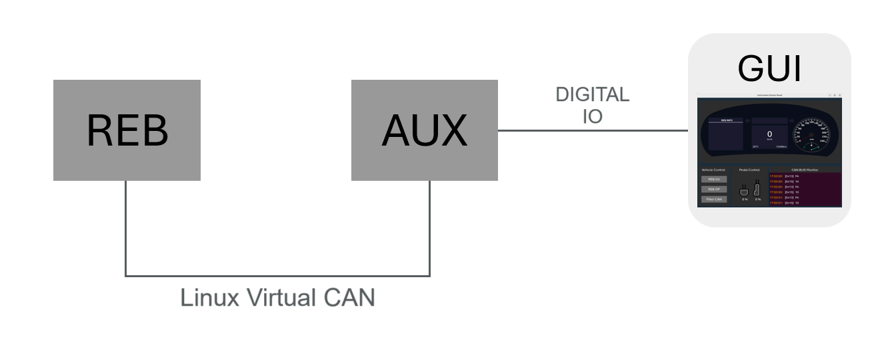
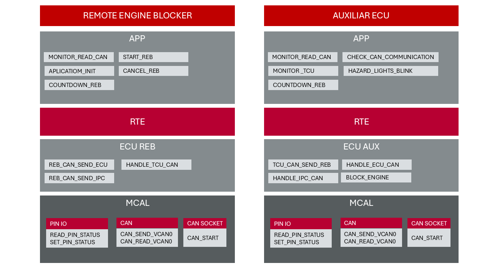

# Remote Engine Blocker - SW2

## 📖 Project Overview

This project is the final assignment of the SW2 class at UFPE. It consists of developing a Remote Engine Blocker (REB) system.

## 🔀 Branch and Commit Standardization

There will be three types of branches:

- feat: creation of new features
- fix: bug fixes
- test: creation of new tests
- docs: documentation updates

For branch creation, the following pattern is established, using Jira card REB-12 as an example:

`(type)/(card-number)_task_description`

Examples of branch creation (with names in English):

```
feat/REB-12_update_readme

fix/REB-12_update_readme

test/REB-12_update_readme

docs/REB-12_update_readme
```

For commits (written in English), a similar approach will be used:
Examples:

`feat: short description of the task functionality`

`fix: short description of the task resolution`

`test: short description of the test`

`docs: short description of the task documentation added/updated`

## 🚀 Getting Started

These instructions will help you get a copy of the project running on your local machine for development and testing purposes.

### System Architecture

This project consists of two programs:

- **REB**: The core engine blocker module.
- **AUX**: An auxiliary module that communicates with REB via Virtual CAN (Linux) and interfaces with the **GUI** through digital I/O. Aux contains Telematics (where you can interact through the buttons), Instrument Panel and Engine functionality.



Each program has an architecture based on AUTOSAR as shown below:



### 📋 Requirements

To run this project the following requirements must be met:
- Linux Operating System
- Build-essentials package;
- gcc version 14.2 or higher;
- lcov version 1.3.1 or higher;
- SDL packages;
- cppcheck package;
- Doxygen and graphviz packages for documentation.

### Installation of SDL, build-essentials and CPPCheck packages

To install SDL, CPPCheck and build-essentials packages, run:
```
sudo apt install cppcheck
sudo apt-get install -y build-essential
sudo apt-get install libsdl2-dev libsdl2-image-dev libsdl2-ttf-dev
```

### Installation of lcov 2.3.1 

To install the required version of lcov, run:
  ```
  sudo apt remove lcov gcov
  sudo apt update
  sudo apt install git make perl
  git clone https://github.com/linux-test-project/lcov.git
  cd lcov
  git checkout v2.3.1
  sudo make install
  ```

After installation, create a symbolic link for gcov-14:
  ```
  sudo ln -s $(which gcov-14) /usr/bin/gcov
  ```

Verify the versions with:
  ```
  lcov --version
  gcov --version 
  ```

### Installation of gcc 14.2 
To install gcc 14.2 execute the following commands:
  ```
  sudo apt remove gcc
  sudo add-apt-repository universe
  sudo apt update
  sudo apt install gcc-14
  gcc-14 --version 
  ```

After installation, set it as the default gcc::
  ```
  sudo ln -s /usr/bin/gcc-14 /usr/bin/gcc
  ```

To check gcc version execute:
  ```
  gcc --version 
  ```
#### Intallation of Doxygen:

```
sudo apt-get install doxygen
sudo apt-get install graphviz
```


### 🔧 Installation

Before executing the program, you need to activate the virtual CAN network in Linux. This setup is already automated in the Makefile. Use the following commands:

- **Create and activate `vcan0` interface:**
  ```
  make can
  ```
- **Deactivate `vcan0` interface:**
  ```
  make downcan
  ```
- **Remove `vcan0` interface:**
  ```
  make delcan
  ```

Once the virtual CAN network is set up, build the project by running:

```
make
```

To run the REB module, execute:

```
make reb
```

To run the AUX module(using another terminal), execute:

```
make aux
```

## DoxyFiles Reports

To generate Doxygen reports execute:
```
doxygen Doxyfile
```

To see reports, execute the docs/html/index.html or

**Create `Doc` and view the html:**
  ```
  make doc
  ```


## Static Misra Analysis Reports

To generate Misra reports for all project files execute:
  ```
  make misra
  ```
To see reports, go to misra folder. There will be a file for each C file with the misra violation report. Alternatively you may generate individual report for aux, bsw and reb with the following commands:
  ```
  make misra-aux
  make misra-bsw
  make misra-reb
  ```
to clean the folder use
  ```
  make misra-clean
  ```


**Create `Doc` and view the html:**
  ```
  make doc
  ```

## ⚙️ Running Tests

To run the test you need to assure that:
- lcov version is 2.3.1 or higher
- gcc version is 14.2 or higher

To run test execute:
  ```
  make test
  ```

To see test coverage execute:
  ```
  make cov
  ```
You may also generate a csv file (test_report.csv) with all test data like test name, requirements, expected test results and actual test results. To do that execute:
  ```
  make test-report
  ```


## ✒️ Authors

- **ANDRÉ ROETGER** - [GitHub](https://github.com/andremgbr) - [LinkedIn](https://www.linkedin.com/in/andre-roetger/)
- **DENNIS PAULINO IRINEU** - [GitHub](https://github.com/DennisIrineu) - [LinkedIn](https://www.linkedin.com/in/dirineu/)
- **FÁBIO MARQUES HENRIQUE** - [GitHub](https://github.com/fabiohennr) - [LinkedIn](https://www.linkedin.com/in/engenheirofabiohenrique/)
- **HEITOR LEITE RAMOS** - [GitHub](https://github.com/hramos94) - [LinkedIn](https://www.linkedin.com/in/heitorlramos/)
- **TERENCE MYREN KUTZNER** - [GitHub](https://github.com/TerenceKutzner) - [LinkedIn](https://www.linkedin.com/in/terence-myren-kutzner/)
